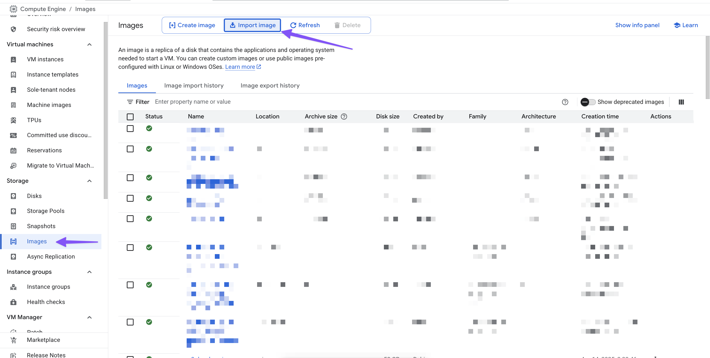
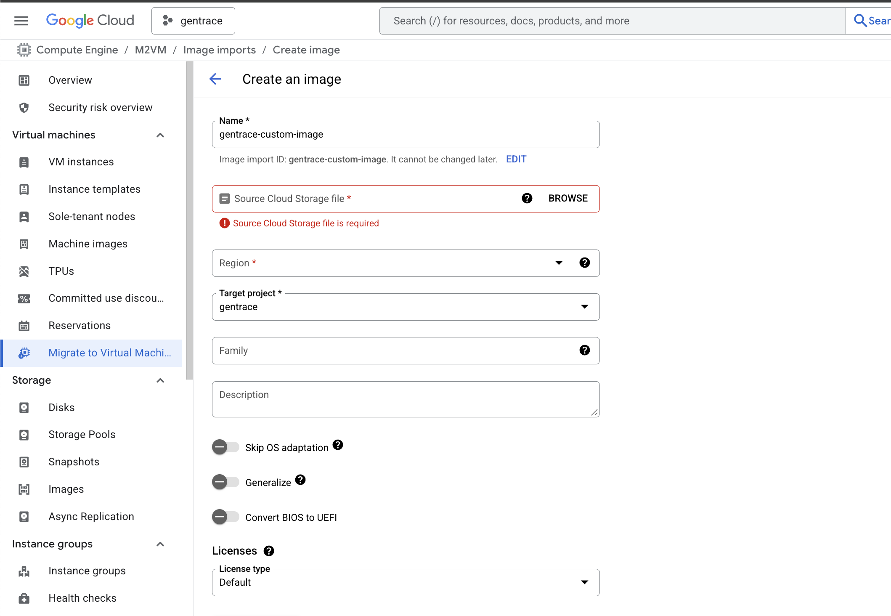
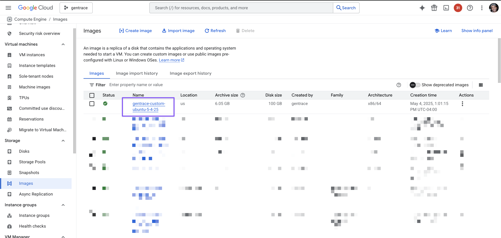
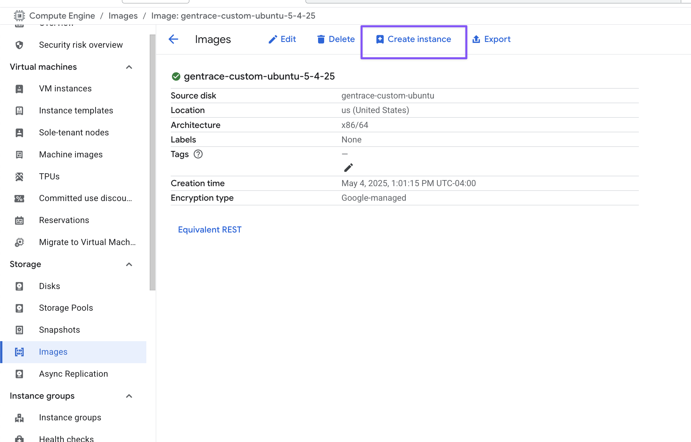
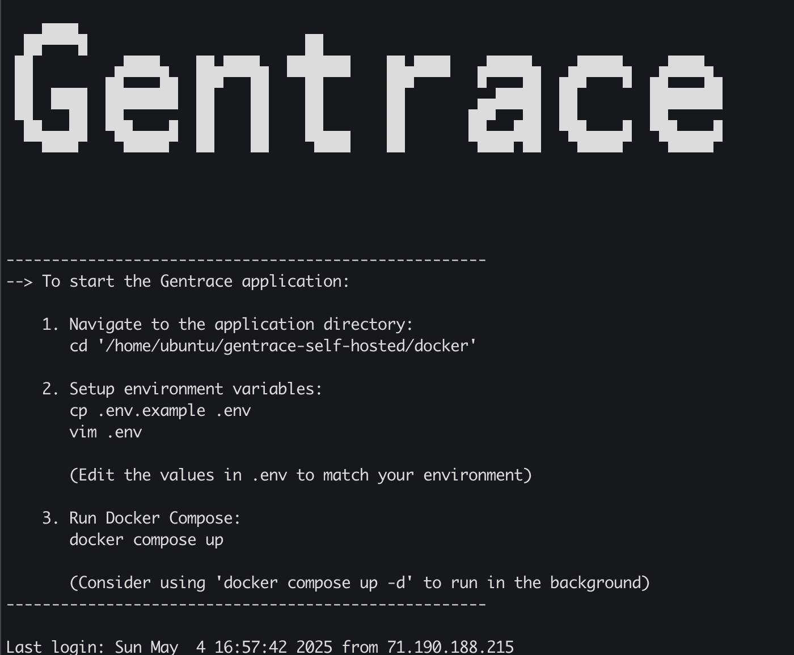

## Gentrace VM Image for GCP

This guide explains how to obtain and use the Gentrace VM image for deployment on Google Cloud Platform (GCP).

## Step 1: Copy the VMDK image to your GCS bucket

The VMDK image is publicly available on Google Cloud Storage. You can copy it directly to your own GCS bucket using the `gsutil` command-line tool.

First, ensure you have `gsutil` installed. If not, follow the [installation instructions](https://cloud.google.com/storage/docs/gsutil_install).

Then, run the following command to copy the image to your bucket. Replace `YOUR_BUCKET_NAME` with the name of your target GCS bucket:

```bash
gsutil cp gs://gentrace-vm-images/gentrace-custom-ubuntu-export-test.vmdk gs://YOUR_BUCKET_NAME/
```

**Alternative Methods:**

> [!WARNING]
> You can also download the image to your local machine first using `gsutil` (`gsutil cp gs://gentrace-vm-images/gentrace-custom-ubuntu-export-test.vmdk .`) or directly via your web browser:
>
> [`https://storage.googleapis.com/gentrace-vm-images/gentrace-custom-ubuntu-export-test.vmdk`](https://storage.googleapis.com/gentrace-vm-images/gentrace-custom-ubuntu-export-test.vmdk)
>
> Afterwards, you must upload it to your own GCS bucket (`gsutil cp gentrace-custom-ubuntu-export-test.vmdk gs://YOUR_BUCKET_NAME/`). Copying directly between buckets using `gsutil cp gs://... gs://...` is usually faster, as the VMDK file is large. Regardless of the method chosen, the VMDK file must be in a GCS bucket before proceeding to the next step.

### Step 2: Import the VMDK as a GCP Image

Once the VMDK file is in your GCS bucket, you can import it as a custom image in Compute Engine.

1.  Navigate to the **Compute Engine** section in the Google Cloud Console.
2.  Go to **Storage** > **Images** in the left-hand menu.
3.  Click the **Import image** button at the top.

    

4.  On the **Create an image** page:

    - Enter a **Name** for your image (e.g., `gentrace-custom-image`).
    - Click **Browse** for the **Source Cloud Storage file** field.
    - Navigate to your GCS bucket and select the `gentrace-custom-ubuntu-export-test.vmdk` file you copied in Step 1.
    - Select the appropriate **Region** and verify the **Target project**.
    - You can typically leave the other settings (Family, Description, OS adaptation, etc.) as their defaults unless you have specific needs.

    

5.  Click **Create** at the bottom of the page.

    > [!NOTE]
    > The import process can take 30 minutes to an hour to complete.

### Step 3: Create a VM Instance from the Image

Once the image import is complete, you can use it to create a new VM instance.

1.  Navigate back to **Compute Engine** > **Storage** > **Images**.
2.  Locate the custom image you created in Step 2 (e.g., `gentrace-custom-image`). It should appear in the list with a green checkmark status.

    

3.  Click on the name of your image.
4.  On the image details page, click the **Create instance** button at the top.

    

5.  Configure your VM instance settings:
    - Choose a **Name** for your instance.
    - Select the desired **Region** and **Zone**.
    - Specify the **Machine configuration** (Series, Machine type).
    - Verify the **Boot disk** is set to your custom image.
    - Configure **Firewall** rules (e.g., allow HTTP/HTTPS traffic if needed).
    - Adjust other settings like **Networking**, **Disks**, etc., as required for your application.
6.  Click **Create** to launch the VM instance.

### Step 4: Access the VM Instance via SSH

To access the newly created VM instance, you will need a specific SSH key pair.

1.  **Obtain SSH Key:** Contact Gentrace support at `support@gentrace.ai` to request the necessary SSH private key (`self_hosted`) and its corresponding public key. The VM instance created from the custom image is already configured with this public key.
2.  **Save Private Key:** Once you receive the private key, save it to a secure location on your local machine, for example, in your `~/.ssh/` directory.
3.  **Set Permissions (Linux/macOS):** Ensure the private key file has the correct permissions. Open your terminal and run:
    ```bash
    chmod 600 <path-to-your-private-key>
    ```
    For example:
    ```bash
    chmod 600 ~/.ssh/self_hosted
    ```
4.  **Connect via SSH:** Use the following command template to connect to your instance. Replace `<path-to-your-private-key>` with the actual path where you saved the private key (e.g., `~/.ssh/self_hosted`) and `<ip-of-gentrace-instance>` with the external IP address of your newly created VM instance (found on the VM instances page in the GCP Console).

    ```bash
    ssh -i <path-to-your-private-key> ubuntu@<ip-of-gentrace-instance>
    ```

    For example:

    ```bash
    ssh -i ~/.ssh/self_hosted ubuntu@<ip-of-gentrace-instance>
    ```

### Step 5: Start the Gentrace Application

Once you have successfully connected to the VM instance via SSH, you will see instructions printed in the terminal for starting the Gentrace application, similar to the image below:



Follow these steps to start the application:

1.  **Navigate to the application directory:**
    ```bash
    cd '/home/ubuntu/gentrace-self-hosted/docker'
    ```
2.  **Setup environment variables:**
    - Copy the example environment file:
    ```bash
    cp .env.example .env
    ```
    - Edit the `.env` file using a text editor (like `vim` or `nano`) to set the required configuration values for your environment.
      ```bash
      vim .env
      ```
      > [!NOTE]
      > For initial setup and testing, you likely won't need to modify many values in the `.env` file. Refer to the main Gentrace self-hosted documentation for detailed configuration options.
3.  **Run Docker Compose:**
    ```bash
    docker compose up
    ```
    Alternatively, to run the application in the background (detached mode), use:
    ```bash
    docker compose up -d
    ```

Your Gentrace instance should now be running.

#### Resetting the Environment (Optional)

If you need to completely reset the application state, including deleting all stored data, you can stop the services and remove the associated Docker volumes. **Warning: This action is irreversible and will delete all data.**

1.  Stop the running services:
    ```bash
    docker compose down
    ```
2.  Remove the volumes:
    `bash
docker compose down -v
`
    After running this, you can restart the application using `docker compose up` (or `docker compose up -d`). You may need to reconfigure the `.env` file if you made changes previously.
